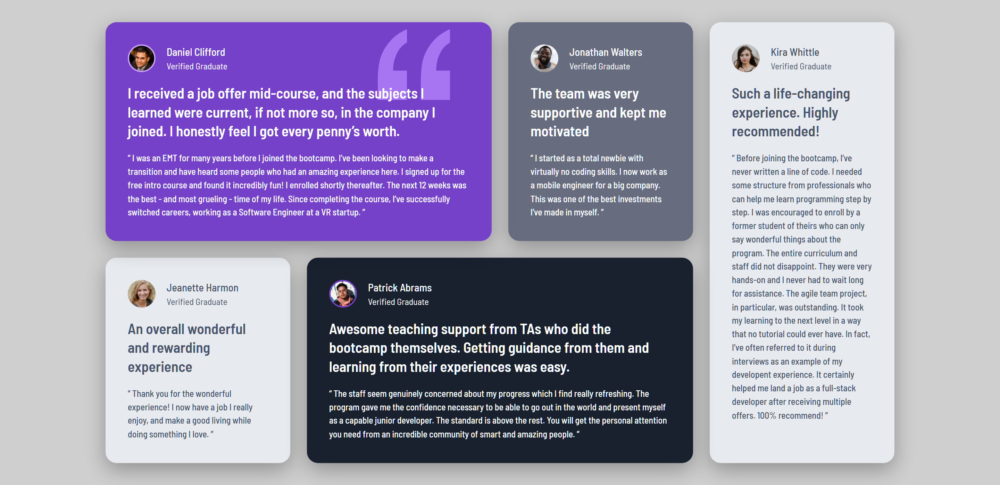

# Frontend Mentor - Testimonials grid section solution

This is a solution to the [Testimonials grid section challenge on Frontend Mentor](https://www.frontendmentor.io/challenges/testimonials-grid-section-Nnw6J7Un7). Frontend Mentor challenges help you improve your coding skills by building realistic projects. 

## Table of contents

- [Overview](#overview)
  - [The challenge](#the-challenge)
  - [Screenshot](#screenshot)
  - [Links](#links)
- [My process](#my-process)
  - [Built with](#built-with)
  - [Continued development](#continued-development)
- [Author](#author)

**Note: Delete this note and update the table of contents based on what sections you keep.**

## Overview

### The challenge

Users should be able to:

- View the optimal layout for the site depending on their device's screen size

### Screenshot

  

### Links

- Solution URL: [GitHub Repo](https://github.com/YOUHAD08/Frontend-Mentor---Testimonials-Grid-Section-.git)
- Live Site URL: [Live Demo](https://your-live-site-url.com)

## My process

### Built with

- Semantic HTML5 markup
- CSS custom properties
- Flexbox
- CSS Grid
- Responsive Design Techniques 
- Google Fonts for enhanced typography using the Barlow Semi Condensed typeface

### Continued development

My next goal is to build a full one-page web suite from scratch. This will help me improve in key areas like layout design, modular CSS, JavaScript interactivity, and performance. I also want to focus on accessibility and refining my structure for better scalability and also improve my skills using Git.

## Author

- Website - [Youhad Ayoub](https://www.your-site.com)
- Frontend Mentor - [@yourusername](https://www.frontendmentor.io/profile/yourusername)
- Twitter - [@yourusername](https://www.twitter.com/yourusername)
